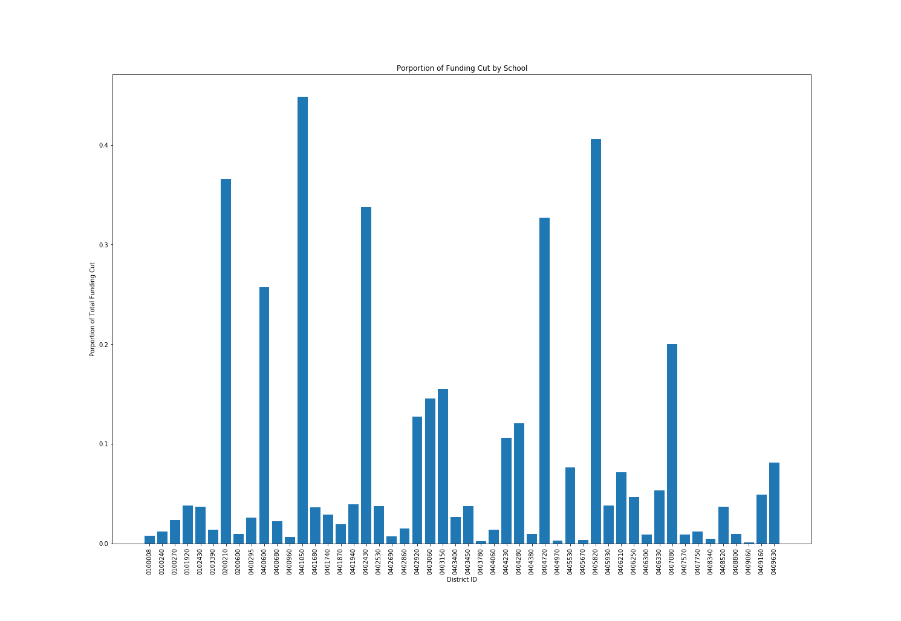
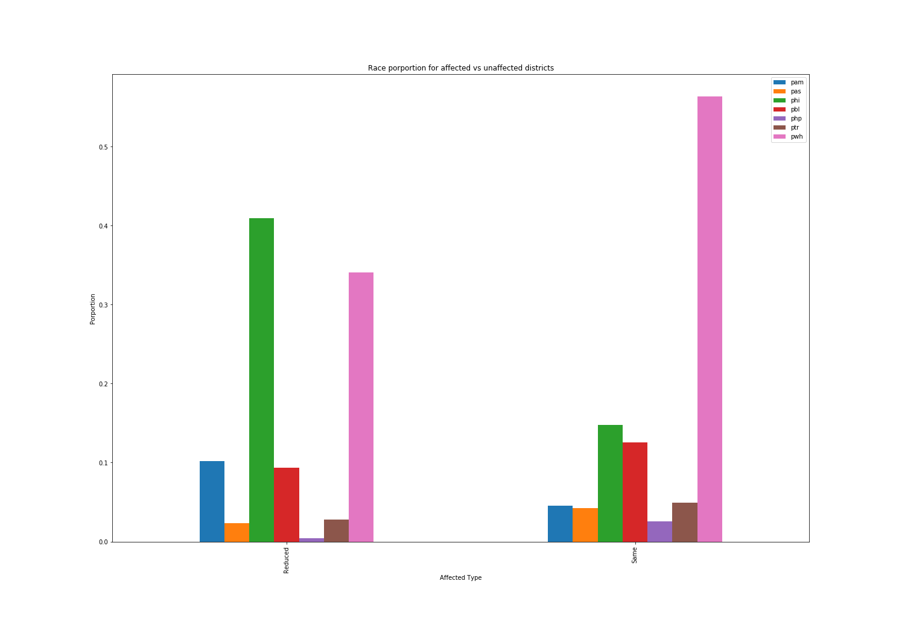
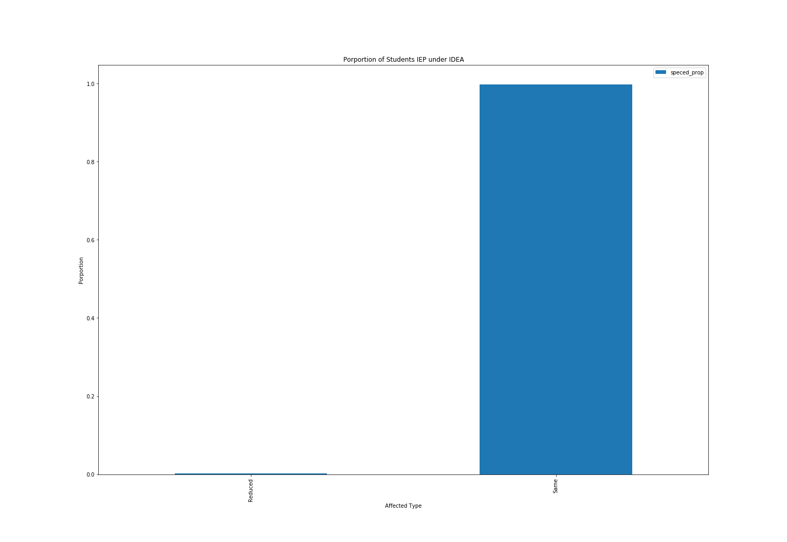

# DS5500_Homework4.1

# Problem 1

The districts that will be affected the most by our budget cuts are:

0200210, 0401050, 0402430,0404720, and 0405820.

# Problem 2

Ideally we would like to see the same race porportion distribution between districts that had their budgets reduced and those districts that did not have their budgets reduced. The reason we would like these two distributions to be the same is to ensure that district budgets aren't affected by an underlying racial bias. Unfortunately, the way in which I decided to create budget cuts did not ensure that racial distributions were the same between the two different types of districts.

# Problem 3

Actually, there appears to be very little in terms of Schools with IEP under IDEA students that are affected by the budget reductions. This obviously is biased, but may not be a bad thing in this instance. More funding might be necessary for IEP under IDEA students and thus, not cutting districts with IEP students would be a good thing.

# Problem 4

# Problem 5
